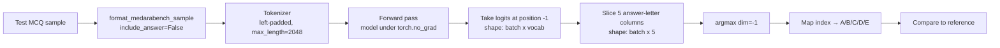
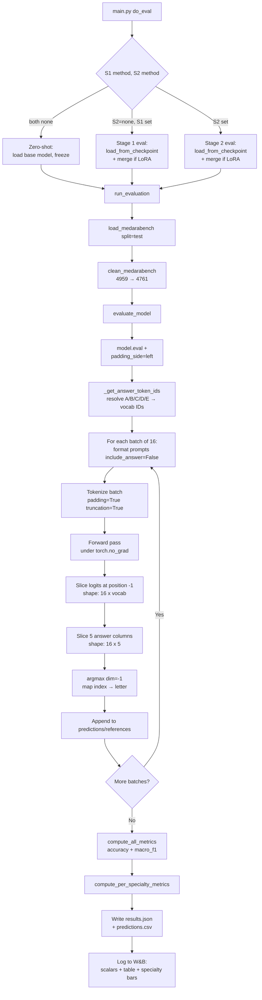

# Evaluation Protocol — Complete Reference

This document fully describes how the pipeline evaluates fine-tuned models on the MedAraBench test set. **Every detail is validated against the live codebase** with line-numbered references. The protocol uses log-probability selection (no text generation) to eliminate decoding-strategy confounds.

---

## Table of Contents

1. [High-Level Overview](#1-high-level-overview)
2. [Test Set Preparation](#2-test-set-preparation)
3. [Model Loading for Evaluation](#3-model-loading-for-evaluation)
4. [Answer Token ID Resolution](#4-answer-token-id-resolution)
5. [The Log-Probability Selection Method](#5-the-log-probability-selection-method)
6. [Batched Inference Details](#6-batched-inference-details)
7. [Metrics](#7-metrics)
8. [Outputs](#8-outputs)
9. [W&B Logging](#9-wb-logging)
10. [End-to-End Flow](#10-end-to-end-flow)
11. [Why No Text Generation?](#11-why-no-text-generation)

---

## 1. High-Level Overview

For every MedAraBench MCQ in the test set, the pipeline:

1. Builds an **input-only prompt** (no answer)
2. Runs a **single forward pass** through the model
3. Reads the **logits at the last position** of the prompt
4. Compares only the logits for the **A/B/C/D/E answer tokens**
5. Picks the letter with the highest logit as the prediction

No autoregressive generation, no sampling, no temperature, no stopping criteria. Just one forward pass + argmax over 5 token IDs.



The whole pipeline lives in [evaluation/evaluate.py](evaluation/evaluate.py).

---

## 2. Test Set Preparation

### Loading and Cleaning

[evaluation/evaluate.py:225-230](evaluation/evaluate.py#L225-L230):

```python
print("Loading and cleaning MedAraBench test set...")
raw_test = load_medarabench(split="test", data_dir=data_dir)
test_dataset = clean_medarabench(raw_test)
if max_samples is not None:
    test_dataset = test_dataset.select(range(min(max_samples, len(test_dataset))))
print(f"  Test samples: {len(raw_test):,} raw → {len(test_dataset):,} clean")
```

The exact same `clean_medarabench()` function used in training is applied to the test set. This wasn't always the case — it was a critical fix in April 2026 (see `DATASETS_AND_PREPROCESSING.md`).

**Test set sizes (verified by running on actual data):**

| Stage | Count |
|---|---|
| Raw test samples | **4,959** |
| After cleaning | **4,761** |
| Removed (invalid answers + empty + missing E + duplicates) | **198** |

After cleaning, every reference label is guaranteed to be a single uppercase letter in `{A, B, C, D, E}`.

### Optional Sample Cap (`max_samples`)

```python
if max_samples is not None:
    test_dataset = test_dataset.select(range(min(max_samples, len(test_dataset))))
```

Used only for `--dry_run` smoke tests (caps at 50 samples). Production runs evaluate on all 4,761 clean samples.

---

## 3. Model Loading for Evaluation

The orchestrator ([main.py:274-315](main.py#L274-L315)) dispatches to one of **three model-loading branches**, depending on what training (if any) was performed:

### Branch A: Zero-shot (`stage1_method == "none" AND stage2_method == "none"`)

[main.py:280-288](main.py#L280-L288):

```python
print("Zero-shot evaluation — loading base model...")
model, tokenizer = load_model_and_tokenizer(
    model_name=args.model,
    method="full",
    load_in_4bit=load_in_4bit,
)
for p in model.parameters():
    p.requires_grad = False
```

Loads the raw HuggingFace base model in bfloat16. All parameters frozen.

### Branch B: Stage 1 Only (`stage2_method == "none" AND stage1_method != "none"`)

[main.py:290-301](main.py#L290-L301):

```python
ckpt = stage1_checkpoint or stage1_dir
model, tokenizer = load_from_checkpoint(
    checkpoint_path=ckpt,
    base_model_name=args.model,
    method=args.stage1_method,
    load_in_4bit=load_in_4bit,
)
if args.stage1_method == "lora":
    merged_dir = os.path.join(eval_dir, "_merged")
    model = merge_lora_and_save(model, merged_dir, tokenizer)
```

Loads the Stage 1 checkpoint. **If it's a LoRA adapter, merge it into the base weights** (via `merge_and_unload()`) for inference efficiency.

### Branch C: Stage 2 Trained (the typical case)

[main.py:303-315](main.py#L303-L315):

```python
ckpt = stage2_checkpoint or stage2_dir
model, tokenizer = load_from_checkpoint(
    checkpoint_path=ckpt,
    base_model_name=args.model,
    method=eval_method,
    load_in_4bit=load_in_4bit,
)
if eval_method == "lora":
    merged_dir = os.path.join(eval_dir, "_merged")
    model = merge_lora_and_save(model, merged_dir, tokenizer)
```

Same logic: load Stage 2 checkpoint, merge if it's a LoRA adapter.

### Why Merge LoRA Before Eval?

A `PeftModel` keeps the base weights frozen and routes activations through the LoRA adapter at every layer — this adds latency on every forward pass. `merge_and_unload()` bakes the adapter into the base weights, producing a plain causal LM that runs at the speed of the unmodified base model. For 4,761 forward passes this matters.

---

## 4. Answer Token ID Resolution

This is the heart of the protocol. The model's vocabulary maps `"A"` to one specific token ID — but **which token ID depends on the tokenizer** and on whether `"A"` appears with or without a leading space.

[evaluation/evaluate.py:28-54](evaluation/evaluate.py#L28-L54):

```python
def _get_answer_token_ids(tokenizer) -> dict[str, int]:
    """
    Return the first token ID for each answer letter.

    Tries both plain ("A") and space-prefixed (" A") variants and picks
    whichever is a single-token encoding.  Falls back to the plain variant.
    """
    candidates = ["A", "B", "C", "D", "E"]
    token_ids: dict[str, int] = {}

    for letter in candidates:
        plain_ids = tokenizer.encode(letter, add_special_tokens=False)
        space_ids = tokenizer.encode(f" {letter}", add_special_tokens=False)

        if len(plain_ids) == 1:
            token_ids[letter] = plain_ids[0]
        elif len(space_ids) == 1:
            token_ids[letter] = space_ids[0]
        else:
            token_ids[letter] = plain_ids[0]

    print("Answer token IDs:")
    for letter, tid in token_ids.items():
        decoded = tokenizer.decode([tid])
        print(f"  {letter} → id={tid}  decoded={decoded!r}")

    return token_ids
```

### Resolution Logic

For each letter `L ∈ {A, B, C, D, E}`:

1. Encode `L` standalone (e.g., `"A"`) → check if it's exactly **1 token** → use that ID.
2. Otherwise encode `" L"` (e.g., `" A"`) → check if it's exactly 1 token → use that ID.
3. Otherwise fall back to the first ID of the plain encoding (multi-token; rare on well-tested tokenizers).

### Why This Matters

The prompt ends with `"### Answer:\n"`. The very next token is what the model is "trying to predict". The relevant logits compare the IDs for the 5 letter tokens — but the tokenizer needs to map the same string `"A"` consistently to a single vocabulary index for the comparison to be meaningful.

**Verified example (Llama-3.1 tokenizer):**

```
Answer token IDs:
  A → id=32  decoded='A'
  B → id=33  decoded='B'
  C → id=34  decoded='C'
  D → id=35  decoded='D'
  E → id=36  decoded='E'
```

These 5 IDs are the only ones the protocol cares about during evaluation.

### Active Letter Filtering

[evaluation/evaluate.py:92-97](evaluation/evaluate.py#L92-L97):

```python
all_answers = set(test_dataset["answer"])
active_letters = sorted(
    [l for l in ["A", "B", "C", "D", "E"] if l in all_answers or l in token_ids]
)
active_token_ids = [token_ids[l] for l in active_letters]
```

Builds the **list of active letters** that should be considered during argmax. After cleaning, all 5 letters A–E are typically present, but this fallback ensures correctness if a test set were missing a letter entirely.

---

## 5. The Log-Probability Selection Method

### Mathematical Formulation

Given a prompt that ends with `"### Answer:\n"`, let `logits ∈ ℝ^{1 × V}` be the vector of logits the model produces at the position immediately after the prompt (i.e., the prediction for the *next* token), where `V` is the vocabulary size.

The predicted answer is:

$$
\hat{y} = \arg\max_{l \in \{A,B,C,D,E\}} \text{logits}[\text{tokenId}(l)]
$$

We **do not** apply a softmax — argmax of logits is invariant under softmax (both produce the same maximum). This saves a computation step.

### Code Implementation

[evaluation/evaluate.py:120-125](evaluation/evaluate.py#L120-L125):

```python
outputs = model(input_ids=input_ids, attention_mask=attention_mask)
last_token_logits = outputs.logits[:, -1, :]  # [batch, vocab]

answer_logits = last_token_logits[:, active_token_ids]  # [batch, num_letters]
predicted_indices = answer_logits.argmax(dim=-1).cpu().tolist()
```

Walkthrough:

1. **Forward pass:** `model(input_ids, attention_mask)` returns a `CausalLMOutput` with `.logits` of shape `[batch, seq_len, vocab]`.
2. **Last-token slice:** `outputs.logits[:, -1, :]` takes the logits at the very last position of each sequence → shape `[batch, vocab]`. Because we use **left padding**, this position is always the real last token of the prompt (not a pad token).
3. **Answer-letter slice:** `last_token_logits[:, active_token_ids]` picks out the 5 specific columns corresponding to the A/B/C/D/E token IDs → shape `[batch, 5]`.
4. **Argmax:** `argmax(dim=-1)` returns the index (0–4) of the highest-logit letter for each sample in the batch.
5. **Map back to letters:** `pred_letter = active_letters[predicted_indices[i]]`.

### Why `outputs.logits[:, -1, :]` and Not `[:, -2, :]`?

The model is autoregressive: position `i` in the logits tensor represents the prediction for token at position `i+1`. With left-padded inputs that end at the real last prompt token, position `-1` is the prediction for the **next** token after the prompt, which is exactly what we want.

---

## 6. Batched Inference Details

[evaluation/evaluate.py:84-149](evaluation/evaluate.py#L84-L149):

### Eval Mode and Padding Side

```python
model.eval()

# Left-padding for batched inference (align right edge of sequences)
original_padding_side = tokenizer.padding_side
tokenizer.padding_side = "left"
```

- **`model.eval()`:** Disables dropout and switches batch norm to inference mode.
- **Left padding switch:** During *training* we use right padding (so loss is computed on the right edge). For *batched inference* we need left padding so that the right edge — where the next-token prediction lives — is at the **same position** (`-1`) across all samples in the batch.
- **Restoration:** [line 149](evaluation/evaluate.py#L149) restores the original padding side after evaluation.

### Tokenization Settings

[evaluation/evaluate.py:111-117](evaluation/evaluate.py#L111-L117):

```python
encoded = tokenizer(
    prompts,
    return_tensors="pt",
    padding=True,
    truncation=True,
    max_length=2048,
)
input_ids = encoded["input_ids"].to(model.device)
attention_mask = encoded["attention_mask"].to(model.device)
```

| Argument | Value | Why |
|---|---|---|
| `return_tensors="pt"` | PyTorch tensors | Direct input to model |
| `padding=True` | dynamic padding | Pad to longest sequence in the batch |
| `truncation=True` | enabled | Truncate from the right if too long (rare; MedAraBench p99 ≈ 85 tokens) |
| `max_length=2048` | 2,048 | Much larger than necessary; safety margin |

### Default Batch Size

[main.py:80-81](main.py#L80-L81):

```python
parser.add_argument("--eval_batch_size", type=int, default=16,
    help="Batch size for evaluation inference.")
```

Defaults to **16 samples per forward pass**. Configurable per run.

### No-Grad Decorator

[evaluation/evaluate.py:61](evaluation/evaluate.py#L61):

```python
@torch.no_grad()
def evaluate_model(...)
```

The entire evaluation function is wrapped in `@torch.no_grad()`. This:

- Disables autograd tracking → no gradient memory overhead
- Reduces peak memory ~2x compared to training
- Speeds up forward passes ~10–20%

### Progress Reporting

[evaluation/evaluate.py:145-147](evaluation/evaluate.py#L145-L147):

```python
if (batch_start // batch_size) % 20 == 0:
    done = min(batch_start + batch_size, len(samples))
    print(f"  Evaluated {done}/{len(samples)} samples...")
```

Prints a progress line every 20 batches (i.e., every 320 samples at batch_size=16).

---

## 7. Metrics

Both metrics are computed using scikit-learn (zero external dependencies beyond what's already installed).

### `compute_accuracy()`

[utils/metrics.py:4-19](utils/metrics.py#L4-L19):

```python
def compute_accuracy(predictions: list, references: list) -> float:
    if len(predictions) != len(references):
        raise ValueError(...)
    return float(accuracy_score(references, predictions))
```

Simple `correct / total` ratio in `[0, 1]`. With 4,761 clean samples and 5 answer classes, the random baseline accuracy is exactly **20.0%**.

### `compute_macro_f1()`

[utils/metrics.py:22-39](utils/metrics.py#L22-L39):

```python
def compute_macro_f1(predictions: list, references: list) -> float:
    if len(predictions) != len(references):
        raise ValueError(...)
    return float(
        f1_score(references, predictions, average="macro", zero_division=0)
    )
```

**Macro F1** = unweighted mean of per-class F1 scores across all 5 answer labels:

$$
F1_{\text{macro}} = \frac{1}{5} \sum_{l \in \{A,B,C,D,E\}} F1_l
$$

where each $F1_l$ is the harmonic mean of precision and recall for class $l$.

**Why macro F1 (not weighted F1)?**

- Macro F1 treats all 5 classes equally, regardless of class frequency in the test set.
- This **penalizes class collapse** — if the model always predicts `A`, accuracy could be ~20% but macro F1 will be much lower because B, C, D, E precision are all 0.
- `zero_division=0` ensures that if a class has no predictions, the F1 for that class is 0 (not NaN).

### `compute_all_metrics()`

[utils/metrics.py:42-51](utils/metrics.py#L42-L51):

```python
def compute_all_metrics(predictions, references) -> dict:
    return {
        "accuracy": compute_accuracy(predictions, references),
        "macro_f1": compute_macro_f1(predictions, references),
    }
```

Convenience wrapper.

### `compute_per_specialty_metrics()`

[utils/metrics.py:54-86](utils/metrics.py#L54-L86):

```python
def compute_per_specialty_metrics(predictions, references, specialties) -> dict:
    groups = defaultdict(lambda: {"preds": [], "refs": []})
    for pred, ref, spec in zip(predictions, references, specialties):
        groups[spec]["preds"].append(pred)
        groups[spec]["refs"].append(ref)

    results = {}
    for spec, data in sorted(groups.items()):
        preds = data["preds"]
        refs = data["refs"]
        results[spec] = {
            "accuracy": compute_accuracy(preds, refs),
            "macro_f1": compute_macro_f1(preds, refs),
            "count": len(preds),
        }
    return results
```

Groups predictions by the `specialty` column from the test set, then computes per-group accuracy + macro F1 + sample count. Used for stratified analysis (which specialties the model handles better/worse).

### Specialty Field Source

[evaluation/evaluate.py:132-134](evaluation/evaluate.py#L132-L134):

```python
specialties.append(
    str(sample.get("specialty", sample.get("umbrella_specialty", "Unknown")))
)
```

Falls back through three levels: `specialty` → `umbrella_specialty` → `"Unknown"`. Both `specialty` and `umbrella_specialty` are real columns in MedAraBench (see `DATASETS_AND_PREPROCESSING.md`).

---

## 8. Outputs

Every evaluation run produces two files in `{output_dir}/eval/`:

### `results.json`

[evaluation/evaluate.py:157-163, 187-189](evaluation/evaluate.py#L157-L163):

```python
results = {
    "accuracy": overall["accuracy"],
    "macro_f1": overall["macro_f1"],
    "total_samples": len(predictions),
    "per_specialty_scores": per_spec,
    "answer_token_ids": {l: token_ids[l] for l in active_letters},
}

results_path = os.path.join(output_dir, "results.json")
with open(results_path, "w", encoding="utf-8") as f:
    json.dump(results, f, indent=2, ensure_ascii=False)
```

Example structure:

```json
{
  "accuracy": 0.6234,
  "macro_f1": 0.5891,
  "total_samples": 4761,
  "per_specialty_scores": {
    "Anatomy": {"accuracy": 0.71, "macro_f1": 0.68, "count": 320},
    "Cardiology": {"accuracy": 0.59, "macro_f1": 0.55, "count": 412},
    ...
  },
  "answer_token_ids": {
    "A": 32, "B": 33, "C": 34, "D": 35, "E": 36
  }
}
```

`ensure_ascii=False` preserves Arabic specialty names in the JSON (no `\uXXXX` escaping).

### `predictions.csv`

[evaluation/evaluate.py:192-198](evaluation/evaluate.py#L192-L198):

```python
preds_path = os.path.join(output_dir, "predictions.csv")
fieldnames = ["question", "reference", "prediction", "correct", "specialty"]
with open(preds_path, "w", newline="", encoding="utf-8") as f:
    writer = csv.DictWriter(f, fieldnames=fieldnames, quoting=csv.QUOTE_ALL)
    writer.writeheader()
    writer.writerows(per_sample_records)
```

Per-sample records ([line 137-142](evaluation/evaluate.py#L137-L142)):

```python
per_sample_records.append({
    "question": sample.get("question", ""),
    "reference": ref_letter,
    "prediction": pred_letter,
    "correct": pred_letter == ref_letter,
    "specialty": specialties[-1],
})
```

Columns: `question, reference, prediction, correct, specialty`. One row per test sample.

**Critical detail:** `quoting=csv.QUOTE_ALL` forces every field to be quoted. This is necessary because Arabic medical questions frequently contain commas — without `QUOTE_ALL`, the question text would bleed into adjacent columns and break parsing. (This was a real bug fixed in April 2026.)

---

## 9. W&B Logging

The evaluation function automatically pushes results to Weights & Biases.

[evaluation/evaluate.py:175-180](evaluation/evaluate.py#L175-L180):

```python
wandb_logger.log_eval_metrics(
    accuracy=overall["accuracy"],
    macro_f1=overall["macro_f1"],
    per_specialty=per_spec,
    stage="eval",
)
```

The logger function ([utils/wandb_logger.py:162-205](utils/wandb_logger.py#L162-L205)) logs four things:

### 1. Scalar Metrics

```python
wandb.log({
    f"{stage}/accuracy": accuracy,
    f"{stage}/macro_f1": macro_f1,
})
wandb.summary.update({
    f"{stage}/accuracy": accuracy,
    f"{stage}/macro_f1": macro_f1,
})
```

Both as a log point (shows in time-series charts) and as run summary fields (shows in the run table).

### 2. Per-Specialty Table

```python
rows = []
for spec, vals in sorted(per_specialty.items()):
    rows.append([spec, vals["count"], round(vals["accuracy"], 4), round(vals["macro_f1"], 4)])

if rows:
    spec_table = wandb.Table(
        columns=["Specialty", "Count", "Accuracy", "Macro F1"],
        data=rows,
    )
    wandb.log({f"{stage}/per_specialty": spec_table})
```

Renders as an interactive sortable table in the W&B UI.

### 3. Per-Specialty Bar Chart Data

```python
specialty_acc = {f"{stage}/specialty/{s[0]}": s[2] for s in rows}
wandb.log(specialty_acc)
```

Logs each specialty's accuracy as an individual metric — these can be plotted as bar charts comparing experiments side-by-side.

### 4. Console Summary

[evaluation/evaluate.py:165-170](evaluation/evaluate.py#L165-L170):

```python
print(f"\n{'='*50}")
print(f"Evaluation Results")
print(f"  Accuracy : {results['accuracy']:.4f}")
print(f"  Macro F1 : {results['macro_f1']:.4f}")
print(f"  Samples  : {results['total_samples']}")
print(f"{'='*50}\n")
```

Standard output captured by SLURM into the `.out` log file.

---

## 10. End-to-End Flow



---

## 11. Why No Text Generation?

The protocol deliberately avoids autoregressive generation. Compared to "generate text, then parse the answer", log-probability selection has several advantages:

### Advantages

| Property | Log-Prob Selection | Text Generation |
|---|---|---|
| **Deterministic** | Yes (pure argmax) | No — depends on sampling temperature, top-k, top-p, beam search, etc. |
| **Speed** | 1 forward pass per sample | Multiple forward passes (one per output token) |
| **Decoding-strategy independence** | N/A | Different sampling configs → different results |
| **Stopping-criterion independence** | N/A | Model may generate "C. Because..." instead of just "C" |
| **Parsing required** | No (just argmax) | Yes (regex to extract A/B/C/D/E from free text) |
| **Reproducible** | Yes (deterministic) | Only with `temperature=0` AND fixed seed |

### Disadvantage

The log-prob method assumes that the model's prediction for the very next token is meaningful. If a base model has never been fine-tuned to output a single letter after `"### Answer:\n"`, it might prefer to output things like `"The"` or `"\n"` instead — but we'd still pick whichever of A/B/C/D/E has the highest logit, even if all 5 are dominated by other vocabulary tokens. This makes the protocol slightly biased toward fine-tuned models, but it's a fair comparison because all experiments use the same protocol.

### Concrete Example

After fine-tuning, the model has learned to prefer one of the 5 letter tokens at the position after `"### Answer:\n"`. The logit distribution at that position looks like:

```
Position -1 logits (top 10 of 128,000):
  Token  | ID    | Logit
  -------+-------+------
  "C"    | 34    | 12.3 ← argmax over {A,B,C,D,E}
  "B"    | 33    | 9.1
  "A"    | 32    | 7.8
  "D"    | 35    | 6.5
  " C"   | 1316  | 3.2
  "\n"   | 198   | 2.1
  "E"    | 36    | 1.4
  ...
```

We don't care that `"C"` (id 34) is the global argmax or that `" C"` (id 1316) is also a high-confidence candidate. We just compare the 5 specific token IDs for `A, B, C, D, E` and pick the highest one. **Result: prediction = C**.

---

## Appendix: Complete Function Call Stack

For reference, the full call chain from `main.py` to file output:

```
main.py:main()                                          [main.py:109]
  → run_evaluation(model, tokenizer, output_dir, ...)   [evaluation/evaluate.py:203]
    → load_medarabench(split="test")                    [data/read_data.py:58]
    → clean_medarabench(raw_test)                       [data/clean_data.py:38]
    → evaluate_model(model, tokenizer, test_dataset)    [evaluation/evaluate.py:62]
      → _get_answer_token_ids(tokenizer)                [evaluation/evaluate.py:28]
      → tokenizer(prompts, padding, truncation)         [HF tokenizer]
      → model(input_ids, attention_mask)                [HF model forward]
      → compute_all_metrics(predictions, references)    [utils/metrics.py:42]
        → compute_accuracy()                            [utils/metrics.py:4]
        → compute_macro_f1()                            [utils/metrics.py:22]
      → compute_per_specialty_metrics(...)              [utils/metrics.py:54]
      → wandb_logger.log_eval_metrics(...)              [utils/wandb_logger.py:162]
      → json.dump(results, ...)                         [→ results.json]
      → csv.DictWriter.writerows(...)                   [→ predictions.csv]
```
