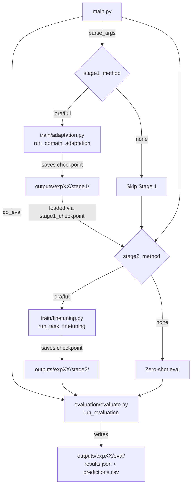
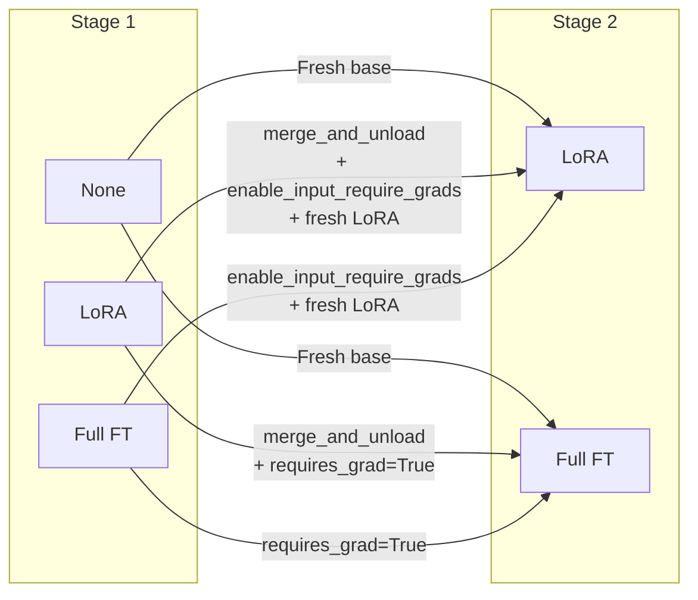
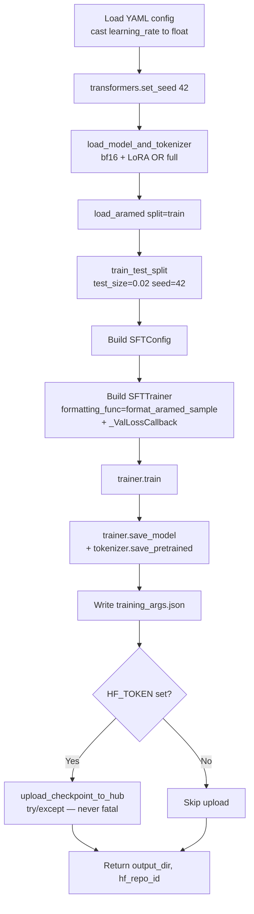
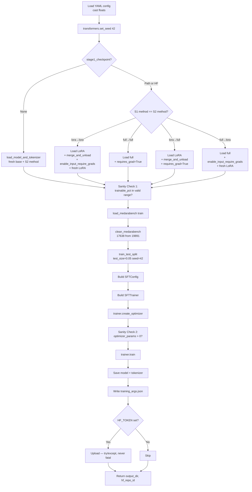

# Modeling & Fine-tuning Configuration — Complete Reference

This document fully describes the model loading logic, fine-tuning strategies, and every hyperparameter used in the pipeline. **Every number, code path, and design decision has been validated against the live codebase.** File references include line numbers so you can verify against the source.

---

## Table of Contents

1. [Architecture Overview](#1-architecture-overview)
2. [Base Models](#2-base-models)
3. [Tokenizer Configuration](#3-tokenizer-configuration)
4. [LoRA Configuration](#4-lora-configuration)
5. [Hyperparameters — Side-by-Side](#5-hyperparameters--side-by-side)
6. [Model Loading Logic](#6-model-loading-logic)
7. [Stage Transition Logic](#7-stage-transition-logic)
8. [Sanity Checks](#8-sanity-checks)
9. [Prompt Templates](#9-prompt-templates)
10. [Training Framework](#10-training-framework-trl-sfttrainer)
11. [Memory Optimizations](#11-memory-optimizations)
12. [Checkpoint Format](#12-checkpoint-format)
13. [Stage 1 Pipeline](#13-stage-1-pipeline-end-to-end)
14. [Stage 2 Pipeline](#14-stage-2-pipeline-end-to-end)

---

## 1. Architecture Overview

The pipeline is a **two-stage causal-LM fine-tuning system** that supports six Stage 1 → Stage 2 transitions across two model families. The orchestrator ([main.py](main.py)) dispatches work to two stage-specific runners ([train/adaptation.py](train/adaptation.py), [train/finetuning.py](train/finetuning.py)), both built on TRL's `SFTTrainer`.



---

## 2. Base Models

The pipeline targets two 8B-parameter base models:

| Model | Parameters | HF Identifier | Notes |
|---|---|---|---|
| **Llama-3.1-8B** | 8.03B | `meta-llama/Llama-3.1-8B` | English-dominant, multilingual |
| **Jais-2-8B-Chat** | 8.13B | `inceptionai/Jais-2-8B-Chat` | Arabic-native, bilingual |

### Model Loading Function

[utils/get_model.py:35-95](utils/get_model.py#L35-L95) — `load_model_and_tokenizer()`:

```python
model = AutoModelForCausalLM.from_pretrained(
    model_name,
    dtype=torch.bfloat16,
    device_map="auto",
    trust_remote_code=True,
)
```

**Key design choices:**

| Flag | Value | Why |
|---|---|---|
| `dtype` | `torch.bfloat16` | 2x memory reduction vs fp32; better numerical range than fp16 |
| `device_map="auto"` | enabled | HF auto-shards across available GPUs |
| `trust_remote_code=True` | enabled | Required for Jais (custom modeling code) |

---

## 3. Tokenizer Configuration

[utils/get_model.py:26-32](utils/get_model.py#L26-L32):

```python
def _configure_tokenizer(tokenizer):
    """Ensure tokenizer has a pad token and right-padding for training."""
    if tokenizer.pad_token is None:
        tokenizer.pad_token = tokenizer.eos_token
        tokenizer.pad_token_id = tokenizer.eos_token_id
    tokenizer.padding_side = "right"
    return tokenizer
```

Critical details:

- **Pad token fallback:** Llama-3.1 has no pad token by default → reuse the EOS token. This is the standard practice in HuggingFace examples.
- **Right padding for training:** required by causal LM loss computation (the right edge of the sequence is where loss is computed on the answer token).
- **For evaluation only:** `evaluation/evaluate.py:86-87` switches to **left padding** temporarily because batched generation/scoring needs the last real token (not pad) at a fixed position across the batch.

---

## 4. LoRA Configuration

### YAML Definition

[configs/lora.yaml:4-18](configs/lora.yaml#L4-L18):

```yaml
lora:
  r: 16
  lora_alpha: 32
  lora_dropout: 0.05
  target_modules:
    - q_proj
    - k_proj
    - v_proj
    - o_proj
    - gate_proj
    - up_proj
    - down_proj
  task_type: CAUSAL_LM
  bias: none
```

### Code Construction

[utils/get_model.py:11-23](utils/get_model.py#L11-L23):

```python
def _build_lora_config(lora_cfg: dict) -> LoraConfig:
    return LoraConfig(
        r=lora_cfg.get("r", 16),
        lora_alpha=lora_cfg.get("lora_alpha", 32),
        lora_dropout=lora_cfg.get("lora_dropout", 0.05),
        target_modules=lora_cfg.get(
            "target_modules",
            ["q_proj", "k_proj", "v_proj", "o_proj",
             "gate_proj", "up_proj", "down_proj"],
        ),
        task_type=TaskType.CAUSAL_LM,
        bias=lora_cfg.get("bias", "none"),
    )
```

### Parameter Breakdown (8B model, verified from cluster log)

For Llama-3.1-8B / Jais-2-8B-Chat:

| Quantity | Value |
|---|---|
| **Trainable LoRA params** | **44,302,336** (~44.3M) |
| **Total params (base + adapter)** | **8,134,703,616** (~8.13B) |
| **Trainable %** | **0.5446%** |

### LoRA Design Decisions

| Parameter | Value | Rationale |
|---|---|---|
| `r` (rank) | 16 | Standard for 8B models (Hu et al. 2022); higher rank gives more capacity but reduces parameter efficiency |
| `lora_alpha` | 32 | Scaling factor; `alpha/r = 2.0` is the recommended default |
| `lora_dropout` | 0.05 | Light regularization on the low-rank update |
| `target_modules` | All 7 linear projections | Attention (Q,K,V,O) **and** MLP (gate, up, down) — broader coverage than the original LoRA paper's Q+V only |
| `bias` | "none" | Don't add bias to LoRA layers (rare to help; doubles parameter count) |
| `task_type` | `CAUSAL_LM` | Tells PEFT to use causal LM loss mask |

**Why all 7 target modules instead of just Q+V?** Empirical evidence from QLoRA paper (Dettmers et al. 2023) shows that targeting **all linear layers** (including MLP) outperforms attention-only LoRA for instruction tuning.

---

## 5. Hyperparameters — Side-by-Side

### Full Comparison

[configs/lora.yaml](configs/lora.yaml) vs [configs/full_ft.yaml](configs/full_ft.yaml):

| Parameter | LoRA Config | Full FT Config | Why Different |
|---|---|---|---|
| `optimizer` | `adamw_8bit` | `adamw_8bit` | Both use bitsandbytes 8-bit AdamW (~50% optimizer memory savings) |
| `learning_rate` | **2e-4** (`0.0002`) | **2e-5** (`0.00002`) | LoRA uses 10x higher LR because only ~0.5% of params train; higher LR compensates for restricted parameter space |
| `lr_scheduler_type` | `cosine` | `cosine` | Smooth decay to zero; standard for fine-tuning |
| `warmup_ratio` | `0.03` (3%) | `0.03` (3%) | Linear warmup over first 3% of steps prevents early divergence |
| `weight_decay` | (unset → 0.0) | `0.01` | LoRA's low-rank constraint provides implicit regularization; full FT needs explicit weight decay |
| `per_device_train_batch_size` | **8** | **4** | Full FT uses more memory (gradients on all 8B params); smaller batch keeps it in 24GB |
| `gradient_accumulation_steps` | **2** | **4** | Maintains **effective batch size = 16** in both cases |
| `max_seq_length` | 512 | 512 | Justified by dataset stats — AraMed p99 ≈ 450 tokens, MedAraBench p99 ≈ 85 tokens |
| `bf16` | `true` | `true` | bfloat16 mixed precision — 2x memory savings, better numeric range than fp16 |
| `gradient_checkpointing` | `true` | `true` | Recompute activations during backward pass → ~40% activation memory savings |
| `logging_steps` | `50` | `50` | W&B logs train metrics every 50 steps |
| `save_strategy` | `epoch` | `epoch` | Checkpoint at the end of each epoch |
| `seed` | `42` | `42` | Reproducibility (`transformers.set_seed(42)`) |

### Stage-Specific Epochs

```yaml
stages:
  domain_adaptation:
    num_train_epochs: 1
  task_specific:
    num_train_epochs: 3
```

**Why 1 epoch for Stage 1:**

- With ~110K AraMed samples, a single epoch is ~6,728 optimizer steps at effective batch size 16
- Multiple epochs over open-ended QA risks overfitting to AraMed's QA format rather than learning generalizable medical knowledge
- Follows continual pre-training practice in LLaMA-2 and BioMedLM

**Why 3 epochs for Stage 2:**

- 17,638 cleaned MCQ samples × 3 epochs ≈ 50K samples seen
- MCQ format is narrow → model needs more passes to converge on answer format
- Verified empirically: validation loss continues to drop through epoch 3

### Float-Casting Defensive Logic

PyYAML parses `2e-4` as the string `"2e-4"` (not as a float — yaml syntax requires a decimal point or explicit `+`/`-` after `e`). Both training scripts defensively cast:

[train/adaptation.py:25-33](train/adaptation.py#L25-L33), [train/finetuning.py:37-45](train/finetuning.py#L37-L45):

```python
def _load_config(config_path: str) -> dict:
    with open(config_path) as f:
        cfg = yaml.safe_load(f)
    # PyYAML parses scientific notation (e.g. 2e-4) as strings — cast floats explicitly
    train = cfg.get("training", {})
    for key in ("learning_rate", "warmup_ratio", "weight_decay"):
        if key in train:
            train[key] = float(train[key])
    return cfg
```

The YAMLs use decimal notation (`0.0002`, `0.00002`) which already parse as floats — the cast is a belt-and-suspenders safety net.

---

## 6. Model Loading Logic

There are **two loader functions** in [utils/get_model.py](utils/get_model.py):

### `load_model_and_tokenizer()` — Fresh Base Model

Used when: no Stage 1 checkpoint exists (i.e., starting from a HuggingFace base model).

**Path A — Method = "lora":**

```python
# 1. Load base in bf16
model = AutoModelForCausalLM.from_pretrained(model_name, dtype=torch.bfloat16, ...)

# 2. CRITICAL: enable input require_grads (needed for gradient checkpointing + LoRA)
if hasattr(model, "enable_input_require_grads"):
    model.enable_input_require_grads()

# 3. Apply LoRA adapter
peft_cfg = _build_lora_config(cfg)
model = get_peft_model(model, peft_cfg)
```

**Path B — Method = "full":**

```python
# 1. Load base in bf16
model = AutoModelForCausalLM.from_pretrained(model_name, dtype=torch.bfloat16, ...)

# 2. Explicitly enable gradients on all params
for param in model.parameters():
    param.requires_grad = True
```

### `load_from_checkpoint()` — Resume from Stage 1

Used when: Stage 2 needs to start from a Stage 1 checkpoint (local dir or HF repo).

**Path A — LoRA checkpoint:**

```python
# 1. Load base model
base = AutoModelForCausalLM.from_pretrained(base_model_name, dtype=torch.bfloat16, ...)

# 2. Attach the saved LoRA adapter (loaded in inference mode, frozen!)
model = PeftModel.from_pretrained(base, checkpoint_path)
```

**Path B — Full checkpoint:**

```python
# Just load the saved full model
model = AutoModelForCausalLM.from_pretrained(checkpoint_path, dtype=torch.bfloat16, ...)
```

### `merge_lora_and_save()` — Bake Adapter into Base

```python
def merge_lora_and_save(model, save_path, tokenizer=None):
    merged = model.merge_and_unload()    # adapter → base weights
    merged.save_pretrained(save_path)
    if tokenizer is not None:
        tokenizer.save_pretrained(save_path)
    return merged
```

Used for transitions where the Stage 1 LoRA must become part of the base model (for Stage 2 LoRA→LoRA and LoRA→Full paths).

---

## 7. Stage Transition Logic

The Stage 2 runner ([train/finetuning.py:127-205](train/finetuning.py#L127-L205)) handles **6 distinct transitions**, each with its own correctness requirements.



### Transition Matrix (validated against code)

| S1 | S2 | Code Path (line) | Operations |
|---|---|---|---|
| None | LoRA | [127-135](train/finetuning.py#L127-L135) | Load fresh base + fresh LoRA |
| None | Full | [127-135](train/finetuning.py#L127-L135) | Load fresh base, all params trainable |
| LoRA | LoRA | [137-156](train/finetuning.py#L137-L156) | Load S1 adapter → **merge_and_unload** → `enable_input_require_grads` → **apply fresh LoRA** |
| LoRA | Full | [158-172](train/finetuning.py#L158-L172) | Load S1 adapter → **merge_and_unload** → set all `requires_grad=True` |
| Full | LoRA | [174-188](train/finetuning.py#L174-L188) | Load full S1 → `enable_input_require_grads` → **apply fresh LoRA** |
| Full | Full | [190-200](train/finetuning.py#L190-L200) | Load full S1 → set all `requires_grad=True` |

### The Critical Bug Fixed in April 2026

**Before fix:** the `LoRA → LoRA` branch simply did `load_from_checkpoint(method="lora")` and passed the result to the trainer. But `PeftModel.from_pretrained()` loads the adapter with `requires_grad=False`. Result: **0 trainable parameters → `grad_norm=0` → model doesn't learn anything in Stage 2**.

**After fix:** the LoRA → LoRA path now explicitly:

1. Loads the S1 adapter
2. `merge_and_unload()` → bakes the adapter back into base weights, producing a plain causal LM
3. `enable_input_require_grads()` on the merged model (required for gradient checkpointing to work with a frozen base + new LoRA)
4. Wraps with a **fresh** `get_peft_model()` → new trainable adapter

[train/finetuning.py:141-156](train/finetuning.py#L141-L156):

```python
print("LoRA S1 → LoRA S2: merging S1 adapter, applying fresh S2 adapter...")
s1_model, tokenizer = load_from_checkpoint(
    checkpoint_path=stage1_checkpoint,
    base_model_name=model_name,
    method="lora",
    load_in_4bit=load_in_4bit,
)
# Merge S1 adapter into base weights
merged_base = s1_model.merge_and_unload()
# Required when combining gradient checkpointing + LoRA on a frozen base
if hasattr(merged_base, "enable_input_require_grads"):
    merged_base.enable_input_require_grads()
# Apply a fresh trainable LoRA adapter
peft_cfg = _build_lora_config(lora_cfg)
model = get_peft_model(merged_base, peft_cfg)
```

### Why `enable_input_require_grads()` is essential

When `gradient_checkpointing=True` is combined with LoRA on a frozen base model, the autograd graph breaks: the base model parameters have `requires_grad=False`, so the input embedding gradients are not computed. The LoRA adapter outputs depend on the base model's intermediate activations — without `enable_input_require_grads()`, gradients can't flow back through the checkpointing boundary to the adapter, causing the same `grad_norm=0` symptom we fixed in the LoRA → LoRA path.

---

## 8. Sanity Checks

After loading the model, the Stage 2 runner runs **two assertions** ([train/finetuning.py:207-229](train/finetuning.py#L207-L229) and [289-299](train/finetuning.py#L289-L299)) that abort the job before training if anything is wrong:

### Check 1: Trainable Parameter Percentage

```python
trainable_params = sum(p.numel() for p in model.parameters() if p.requires_grad)
total_params = sum(p.numel() for p in model.parameters())
pct = 100.0 * trainable_params / max(total_params, 1)

if method == "lora":
    assert 0.01 < pct < 10.0, (
        f"LoRA Stage 2 should have 0.01-10% trainable params, got {pct:.4f}%."
    )
elif method == "full":
    assert pct > 99.0, (
        f"Full Stage 2 should have ~100% trainable params, got {pct:.4f}%."
    )
```

| Method | Expected % | Actual % (8B verified) |
|---|---|---|
| LoRA | 0.01–10% | **0.5446%** |
| Full | >99% | ~100% |

### Check 2: Optimizer Parameter Count

```python
trainer.create_optimizer()
optimizer_params = sum(
    p.numel()
    for group in trainer.optimizer.param_groups
    for p in group["params"]
)
print(f"  Optimizer tracking: {optimizer_params:,} parameters")
assert optimizer_params > 0, (
    "Optimizer has no parameters to update! Stage 2 training would be a no-op."
)
```

Cross-validates that the optimizer actually received the trainable parameters. Catches edge cases where `requires_grad=True` is set but the optimizer's `param_groups` is empty.

**Verified output from a real 8B Stage 2 LoRA run:**

```
[Stage 2 Sanity Check]
  Trainable params: 44,302,336 (0.54%)
  Total params:     8,134,703,616
  S1 method: full | S2 method: lora
  Sanity check PASSED
  Optimizer tracking: 44,302,336 parameters
```

---

## 9. Prompt Templates

### Stage 1 — AraMed (open-ended)

[utils/prompt_template.py:8-19](utils/prompt_template.py#L8-L19):

```python
def format_aramed_sample(sample: dict) -> str:
    question = str(sample.get("question", "")).strip()
    answer = str(sample.get("answer", "")).strip()
    return (
        f"### Question:\n{question}\n\n"
        f"### Answer:\n{answer}"
    )
```

Produces:
```
### Question:
{Arabic question}

### Answer:
{Arabic free-text doctor answer}
```

### Stage 2 / Evaluation — MedAraBench (MCQ)

[utils/prompt_template.py:26-61](utils/prompt_template.py#L26-L61):

```python
def format_medarabench_sample(sample: dict, include_answer: bool = True) -> str:
    question = sample["question"]
    opt_a, opt_b, opt_c, opt_d, opt_e = ...

    options_block = (
        f"A) {opt_a}\n"
        f"B) {opt_b}\n"
        f"C) {opt_c}\n"
        f"D) {opt_d}"
    )
    if opt_e:
        options_block += f"\nE) {opt_e}"

    prompt = (
        f"### Question:\n{question}\n\n"
        f"### Options:\n{options_block}\n\n"
        f"### Answer:\n"
    )

    if include_answer:
        return prompt + answer
    return prompt
```

**Training format** (`include_answer=True`):
```
### Question:
{Arabic medical MCQ}

### Options:
A) {option A}
B) {option B}
C) {option C}
D) {option D}
E) {option E}

### Answer:
C
```

**Eval format** (`include_answer=False`):
```
### Question:
{Arabic medical MCQ}

### Options:
A) {option A}
B) {option B}
C) {option C}
D) {option D}
E) {option E}

### Answer:
```

**Key design choice:** Option E is conditionally appended only if `opt_e` is non-empty. Some MCQs in the dataset have only 4 options (A–D), so the prompt adapts.

---

## 10. Training Framework — TRL SFTTrainer

Both stages use [TRL's `SFTTrainer`](https://huggingface.co/docs/trl) with `SFTConfig`. The exact arguments are identical between stages, except for batch size and epochs.

### SFTConfig Construction

[train/finetuning.py:255-277](train/finetuning.py#L255-L277):

```python
sft_config = SFTConfig(
    output_dir=output_dir,
    num_train_epochs=num_epochs,
    per_device_train_batch_size=train_cfg.get("per_device_train_batch_size", 4),
    per_device_eval_batch_size=1,
    gradient_accumulation_steps=train_cfg.get("gradient_accumulation_steps", 4),
    eval_accumulation_steps=8,
    learning_rate=train_cfg.get("learning_rate", 2e-4),
    lr_scheduler_type=train_cfg.get("lr_scheduler_type", "cosine"),
    warmup_ratio=train_cfg.get("warmup_ratio", 0.03),
    weight_decay=train_cfg.get("weight_decay", 0.0),
    bf16=use_bf16,
    gradient_checkpointing=train_cfg.get("gradient_checkpointing", True),
    logging_steps=train_cfg.get("logging_steps", 50),
    save_strategy=train_cfg.get("save_strategy", "epoch"),
    eval_strategy="epoch",
    seed=train_cfg.get("seed", 42),
    optim=train_cfg.get("optimizer", "adamw_torch"),
    max_length=max_seq_length,
    packing=False,
    report_to="wandb",
    run_name=os.environ.get("WANDB_NAME") or f"...",
)
```

### Hardcoded vs Config-Driven Args

| Argument | Source | Value |
|---|---|---|
| `output_dir` | function arg | per-experiment dir |
| `num_train_epochs` | YAML `stages.*.num_train_epochs` | 1 or 3 |
| `per_device_train_batch_size` | YAML | 8 (LoRA) or 4 (Full) |
| `per_device_eval_batch_size` | **HARDCODED** | **1** — prevents eval OOM |
| `gradient_accumulation_steps` | YAML | 2 (LoRA) or 4 (Full) |
| `eval_accumulation_steps` | **HARDCODED** | **8** — accumulates predictions before moving to CPU |
| `learning_rate` | YAML | 2e-4 or 2e-5 |
| `lr_scheduler_type` | YAML | `cosine` |
| `warmup_ratio` | YAML | 0.03 |
| `weight_decay` | YAML | 0.01 (Full only) |
| `bf16` | derived | `True` unless `--dry_run` |
| `gradient_checkpointing` | YAML | `True` |
| `logging_steps` | YAML | 50 |
| `save_strategy` | YAML | `epoch` |
| `eval_strategy` | **HARDCODED** | **`epoch`** — runs validation after each epoch |
| `seed` | YAML | 42 |
| `optim` | YAML | `adamw_8bit` |
| `max_length` | YAML | 512 |
| `packing` | **HARDCODED** | **`False`** — don't pack short examples; we want clean prompt boundaries |
| `report_to` | **HARDCODED** | **`wandb`** |
| `run_name` | derived | `{model}_s1-{m1}_s2-{m2}` |

### Validation Loss Callback

A custom `TrainerCallback` reports `eval_loss` to W&B at the end of each evaluation:

[train/finetuning.py:48-61](train/finetuning.py#L48-L61):

```python
class _ValLossCallback(TrainerCallback):
    def __init__(self, stage: str):
        self.stage = stage

    def on_evaluate(self, args, state, control, metrics=None, **kwargs):
        if metrics is None:
            return control
        val_loss = metrics.get("eval_loss")
        if val_loss is not None:
            epoch = int(state.epoch) if state.epoch else state.global_step
            wandb_logger.log_validation_loss(val_loss, epoch=epoch, stage=self.stage)
        return control
```

---

## 11. Memory Optimizations

The pipeline must fit an 8B model fine-tune on a 24GB A10G GPU. Multiple techniques combine to make this possible:

| Optimization | Where | Savings | Why It Works |
|---|---|---|---|
| **bfloat16 training** | `bf16=True` in SFTConfig | 50% vs fp32 | Mixed-precision; AdamW master weights stay fp32 |
| **AdamW 8-bit** | `optim="adamw_8bit"` | ~50% optimizer states | bitsandbytes stores moments in 8-bit |
| **Gradient checkpointing** | `gradient_checkpointing=True` | ~40% activation memory | Recompute activations during backward pass |
| **max_seq_length=512** | YAML | ~4x less attention memory | Justified by data: AraMed p99=450, MedAraBench p99=85 |
| **per_device_eval_batch_size=1** | hardcoded | Prevents eval OOM | Eval pass has different memory profile than train |
| **eval_accumulation_steps=8** | hardcoded | Prevents eval OOM | Move predictions to CPU every 8 steps |
| **enable_input_require_grads()** | conditional | enables grad flow | Required when combining gradient_checkpointing + LoRA on frozen base |
| **device_map="auto"** | model load | shards across GPUs | HF Accelerate splits the model across visible devices |

### Memory Budget for 8B + LoRA on a Single A10G (24GB)

| Component | Memory | Note |
|---|---|---|
| Base model (bf16) | 16 GB | 8B × 2 bytes |
| LoRA adapter | ~0.1 GB | 44M × 2 bytes (bf16) |
| Optimizer states (8-bit) | ~0.5 GB | Only on trainable params |
| Activation memory (with checkpointing) | ~3-4 GB | Recomputed during backward |
| Gradients | ~0.2 GB | Only on trainable params (LoRA only) |
| **Total** | **~20 GB** | Fits in 24GB with room to spare |

For full FT (all 8B params trainable):

| Component | Memory |
|---|---|
| Base model (bf16) | 16 GB |
| Optimizer states (8-bit AdamW) | ~16 GB |
| Gradients (bf16) | 16 GB |
| **Total without checkpointing** | **48 GB ❌** |

This is why **full FT requires 4× A10G (96 GB total)** with `device_map="auto"` to shard.

---

## 12. Checkpoint Format

After each stage, the model is saved to disk via `trainer.save_model()`:

### LoRA Checkpoint

```
outputs/exp01_llama_lora_lora/stage1/
├── adapter_config.json          # PEFT config (r, alpha, target_modules, ...)
├── adapter_model.safetensors    # Only the LoRA adapter weights (~80MB for 8B)
├── tokenizer.json
├── tokenizer_config.json
├── special_tokens_map.json
├── training_args.bin            # TRL SFTConfig
├── training_args.json           # Custom metadata (model_name, method, epochs, ...)
└── README.md                    # Generated by hf_hub.py
```

### Full FT Checkpoint

```
outputs/exp02_llama_full_full/stage1/
├── model.safetensors            # Full model weights (~16GB for 8B in bf16)
├── config.json                  # Model config
├── generation_config.json
├── tokenizer.json
├── tokenizer_config.json
├── special_tokens_map.json
├── training_args.bin
├── training_args.json
└── README.md
```

### Metadata JSON (`training_args.json`)

For Stage 1 ([train/adaptation.py:185-195](train/adaptation.py#L185-L195)):

```json
{
  "model_name": "meta-llama/Llama-3.1-8B",
  "method": "lora",
  "stage": "domain_adaptation",
  "num_epochs": 1,
  "config_path": "configs/lora.yaml",
  "train_samples": 107637,
  "val_samples": 2197
}
```

For Stage 2 ([train/finetuning.py:314-326](train/finetuning.py#L314-L326)):

```json
{
  "model_name": "meta-llama/Llama-3.1-8B",
  "stage1_method": "lora",
  "stage2_method": "lora",
  "stage": "task_specific",
  "num_epochs": 3,
  "config_path": "configs/lora.yaml",
  "stage1_checkpoint": "outputs/exp01_llama_lora_lora/stage1",
  "train_samples": 16756,
  "val_samples": 882
}
```

---

## 13. Stage 1 Pipeline (End-to-End)

[train/adaptation.py:57-221](train/adaptation.py#L57-L221) — `run_domain_adaptation()`:



**Verified numbers (from a real Llama-3.1-8B Full S1 run on the cluster):**

| Metric | Value |
|---|---|
| Train samples | 107,637 |
| Val samples | 2,197 |
| Steps per epoch | 6,728 (107,637 / 16 effective batch) |
| Total epochs | 1 |
| Stage 1 wall time | ~7h 10m on 4× A10G |
| Final train loss | ~2.55 |
| Final eval loss | 2.68 |
| Final eval token accuracy | 0.48 |

---

## 14. Stage 2 Pipeline (End-to-End)

[train/finetuning.py:64-352](train/finetuning.py#L64-L352) — `run_task_finetuning()`:



**Verified numbers (from a real Jais-2-8B-Chat Full→LoRA S2 run):**

| Metric | Value |
|---|---|
| Train samples (after split) | 16,756 |
| Val samples (after split) | 882 |
| Trainable LoRA params | 44,302,336 (0.54% of 8.13B) |
| Optimizer tracking | 44,302,336 |
| Steps per epoch | ~1,048 |
| Total epochs | 3 |
| Final train loss | 0.93 |
| Final eval loss | 1.75 |
| Final eval token accuracy | 0.69 |
| Stage 2 wall time | ~1h 50m on 4× A10G |

---

## Appendix: All Imports Needed

The pipeline uses these key dependencies (all validated in source):

| Package | Used For | Min Version |
|---|---|---|
| `torch` | Model loading, bf16 | >= 2.1.0 |
| `transformers` | `AutoModelForCausalLM`, `AutoTokenizer`, `TrainerCallback`, `set_seed` | (TRL-compatible) |
| `trl` | `SFTTrainer`, `SFTConfig` | 1.0.0 |
| `peft` | `LoraConfig`, `TaskType`, `get_peft_model`, `PeftModel` | >= 0.10 |
| `bitsandbytes` | `adamw_8bit` optimizer | >= 0.43 |
| `datasets` | `Dataset`, `train_test_split` | >= 2.18 |
| `yaml` | Config loading | (any) |
| `accelerate` | `device_map="auto"` model sharding | >= 0.28 |
